# Sagacraft

# Немного о проекте

Sagacraft - это проект модифицированной версии Minecraft Java Edition 1.20.1. Суть версии не сильно отличается от оригинальной концепции игры, но дополняет её возможностью провести время в компании друзей из Саги даже когда между вами многие километры, а до встречи на смене ещё очень долго, и потому заточена под игру на выделенном сервере.

Наш адрес: `91.197.99.163:25565`

# Инструкция по установке

Чтобы присоединиться к игре в Sagacraft, необходимо выполнить ряд действий, каждое из которых описано ниже:

## ***1. Установка Minecraft***

Во-первых, необходимо поставить на свой компьютер нужную версию Minecraft и подготовить её к модификации. Для этого скачиваем лаунчер Minecraft. 

>В интернете существует множество программ-лаунчеров, но мы рекомендуем вам пользоваться **TLauncher** и дальнейший гайд будем вести для него.

### - ***Скачайте установщик лаунчера***. 

Для этого переходим по [ссылке](https://tlauncher.ru/) и нажмите на кнопку *"Скачать TLauncher"*, после этого во всплывшем окне выберите операционную систему, которая установлена на вашем компьютере (Windows, MacOS, Linux) и нажмимаем на кнопку *"TLauncher для <название вашей операционной системы>"*

### - ***Запустите установщик лаунчера и установите TLauncher***. 

Запускаем файл `TLauncher-Installer.exe` и следуем инструкциям по установке в самом установщике (Yandex Browser ставить не обязательно :) ).

### - ***Запустите TLauncher***

Перед нами появится окно лаунчера

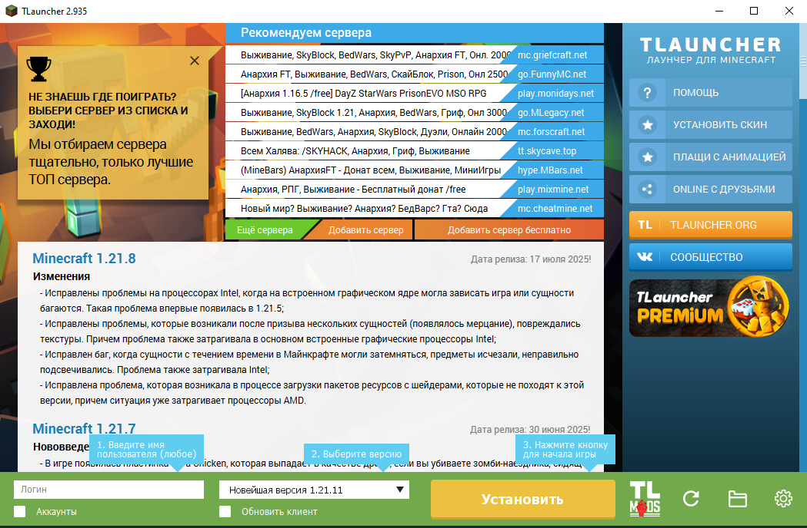

### - ***Создайте сборку Minecraft***

Нас интересует кнопка *"TL Mods"*. Нажимаем на неё

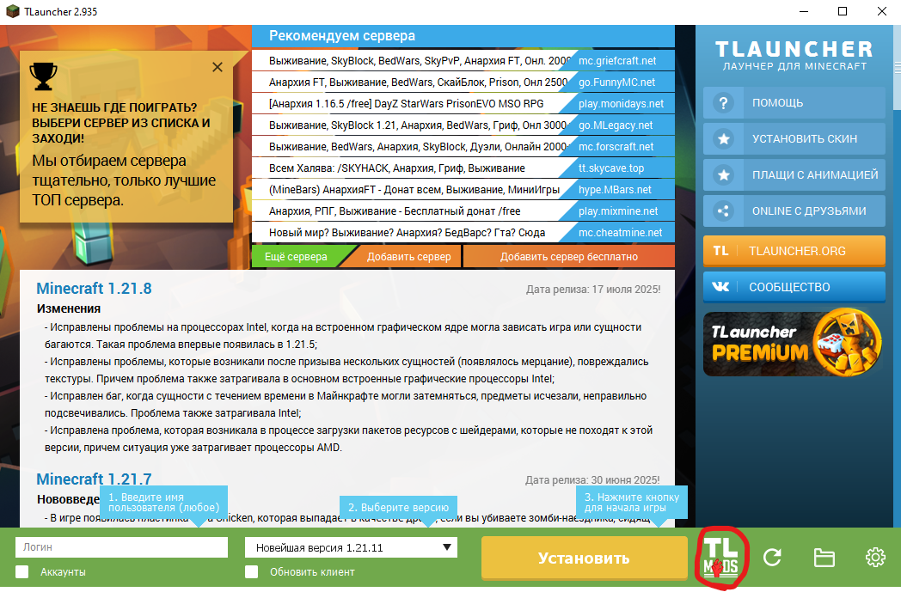

После оказываемся в меню сборок. Там создаём свою сборку. Для этого нажимаем на кнопку *"Создать"*

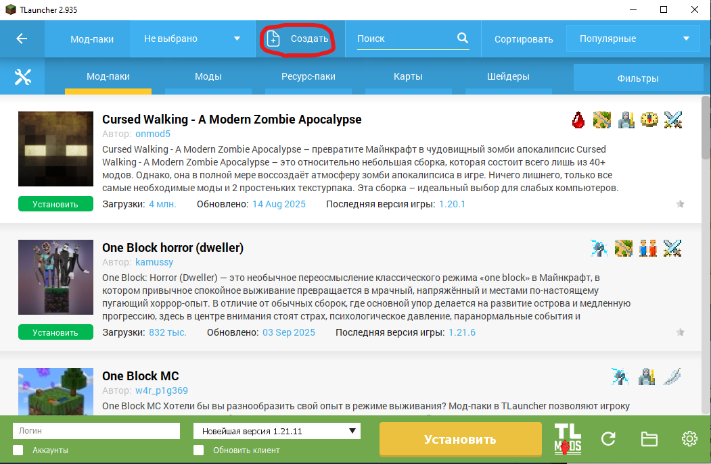

Откроется всплывающее окно *"Создание мод-пака"*. Внимательно выставляем настройки согласно скрину ниже, а затем нажимаем на кнопку *"Создать"*:

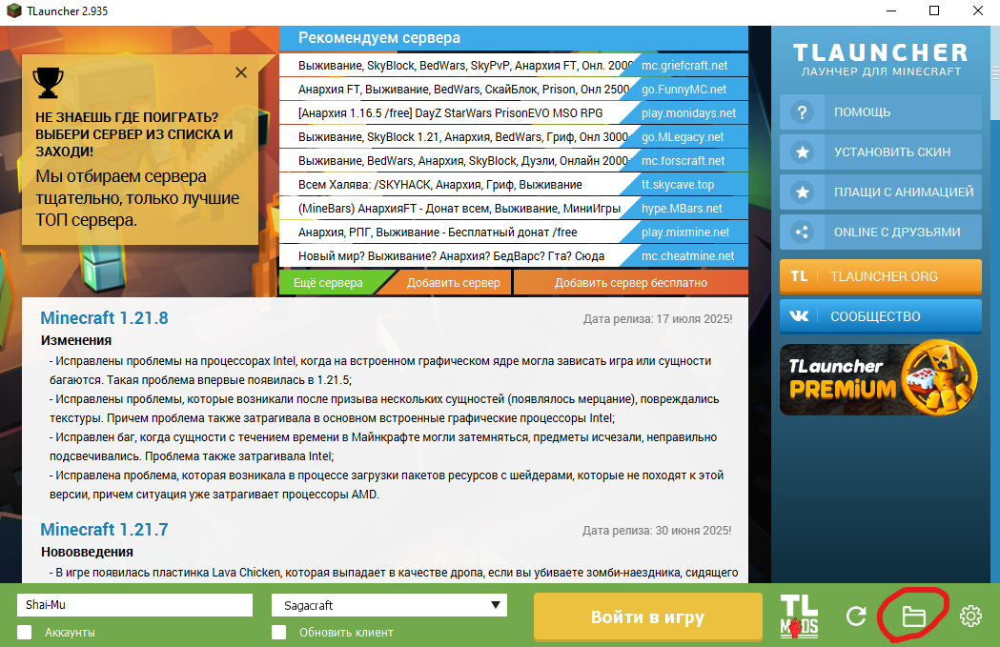
(Название: Sagacraft (или любое, состоящее только из латинских букв); Тип версии: Fabric; Версия игры: 1.20.1; Название версии: 0.18.3; Использовать настройки лаунчера: да; Использовать систему скинов TLauncher.org: нет; Добавить Sodium: нет)

### - ***Завершите Minecraft***

Готово, теперь запустим Minecraft, чтобы сгенерировать основные файлы игры. Для этого заполняем поле *"Логин"* в изначальном окне лаунчера ***любым ником*** (программа вернёт нас в него после создания сборки):

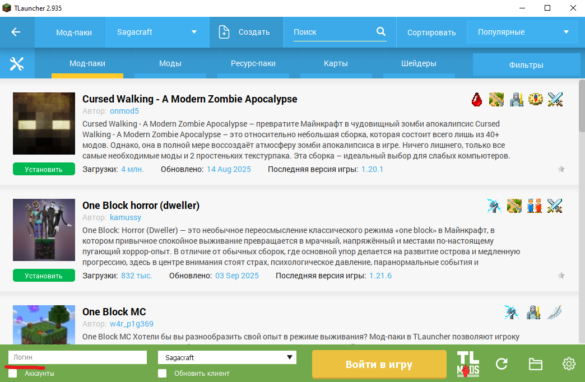

> Помимо использования логина можно использовать и аккаунт TLauncher или Microsoft (при наличии такого с купленной лицензией Minecraft Java Edition)

Запускаем игру через кнопку *"Войти в игру"*

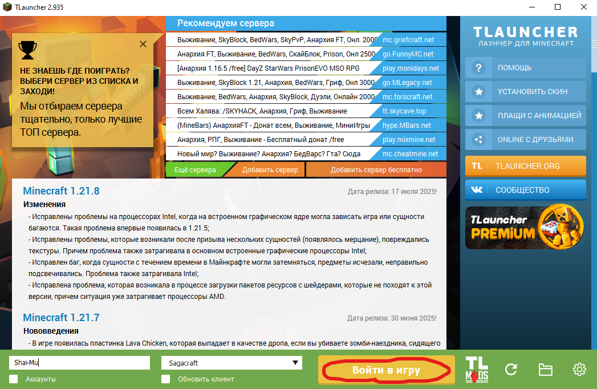

> Первый запуск займёт какое-то время, поскольку включает в себя загрузку и базовую настройку всех необходимых файлов самой игры. В какой-то момент лаунчер может закрыться - это нормально, ждём запуска игры

Закрываем игру. Установка базовой версии Minecraft завершена!

## ***2. Установка Sagacraft***

Теперь нам необходимо модифицировать игру для того, чтобы она соответствовала серверу Sagacraft

### - ***Скачайте Sagacraft***

Для этого переходим по ссылке на последний [релиз](https://github.com/Shai-Mu/sagacraft-client/releases/latest) сборки и скачиваем Sagacraft.x.x.x.zip в любое место на компьютере

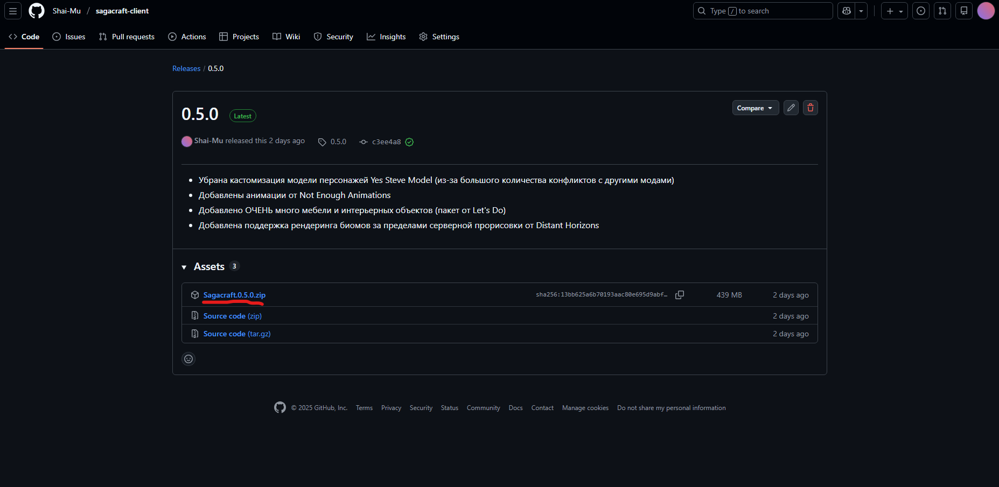

### - ***Разместите файлы Sagacraft в установленной версии Minecraft***

Открываем лаунчер и нажимаем на кнопку с иконкой папки

Откроется папка с игрой, переходим в подпапку `versions`, а затем в папку с установленной версией (если всё сделано в точности согласно гайду, это должна быть папка `Sagacraft`)

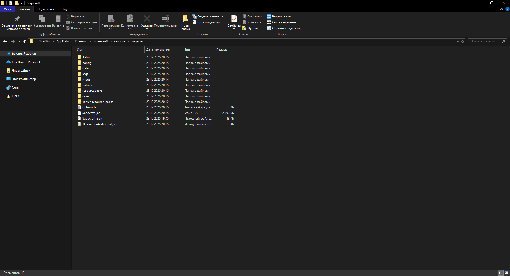

Содержимое архива извлекаем таким образом, чтобы папки `config`, `mods`, `resourcepacks`, `shaderpacks` и файл `options.txt` копировались с заменой в открытую папку

## ***3. Подключение к серверу Sagacraft***

Осталось подключиться на игровой сервер и начать игру

### - ***Запустите Sagacraft***

Возвращаемся в игровой лаунчер и снова нажимаем на кнопку *"Войти в игру"*, чтобы запустить игру. Запуск модифицированной версии занимает существенное время - это нужно иметь ввиду.

### - ***Подключитесь к серверу***

У нас откроется главное игровое меню. Нажимаем на кнопку *"Сетевая игра"*

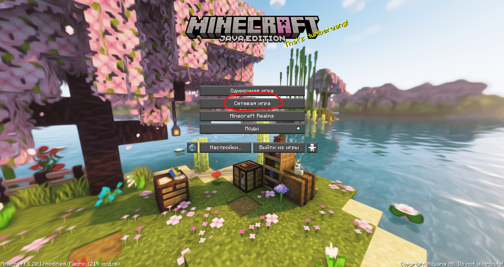

Откроется меню сетевой игры. Нажимаем на кнопку *"Добавить"*

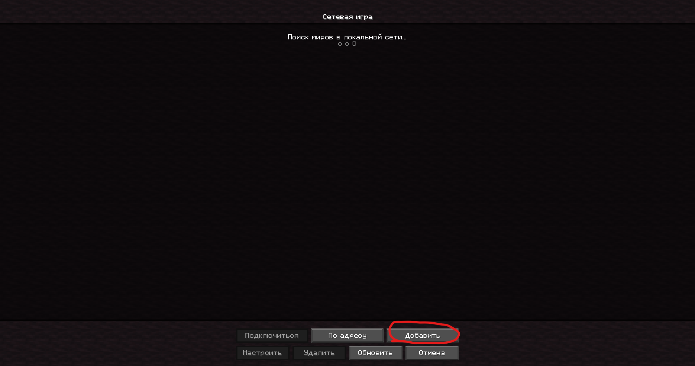

В открывшемся меню вбиваем адрес сервера: `91.197.99.163:25565` и нажимаем кнопку *"Готово"*

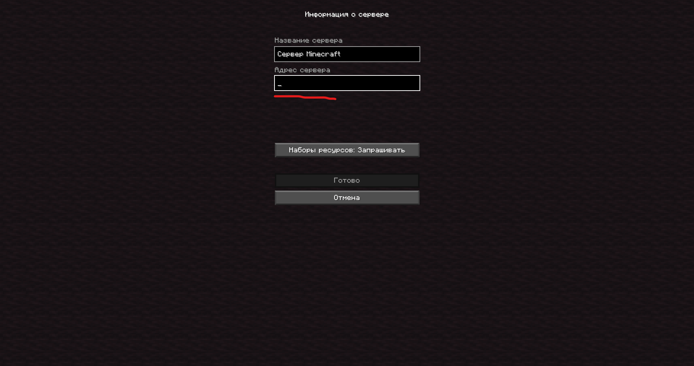

После этого в меню сетевой игры должен появиться сервер, наводимся на него и жмём на появившуюся **после наведения** иконку треугольника

> Иногда сервер может долго не отвечать и писать, что он не доступен. Даже в таком случае имеет смысл попробовать подключиться к сервер
> Также часто возникает проблема, из-за которой при первом заходе на сервер игра может вылетать. Лечится повторным заходом на сервер. Мы знаем про эту проблему и работаем над ней :)
В итоге мы окажемся на сервере и в игровом чате нам будет предложено зарегистрироваться на сервере:

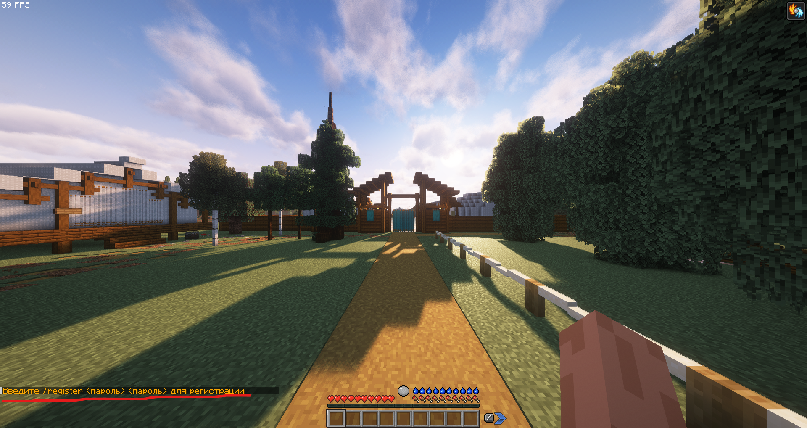

Придумываем пароль, нажимаем клавишу `/` и вводим команду register, а затем дважды пароль через пробел. Должно получиться что-то вроде:

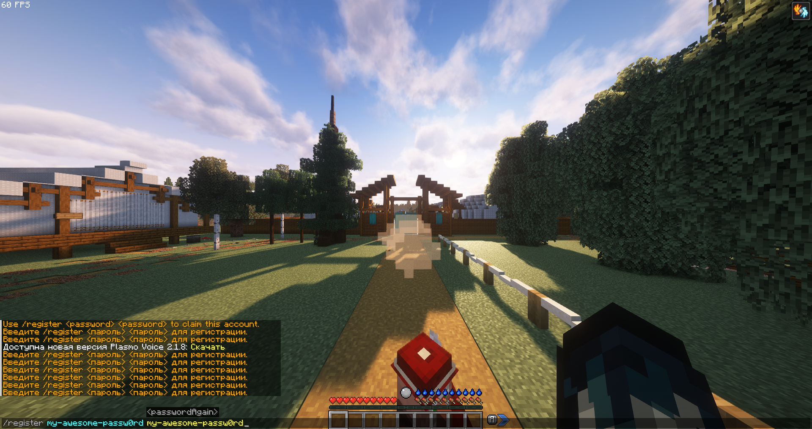

Нажимаем Enter... Теперь можно играть!

# Обратная связь и техническая поддержка

При возникновении вопросов и замечаний касательно работы сервера все желающие могут зайти в наш [дискорд канал](https://discord.gg/yDAe5HpjSZ) или завевсти [запрос](https://github.com/Shai-Mu/sagacraft-client/issues) на техническую поддержку в этом репозитории
