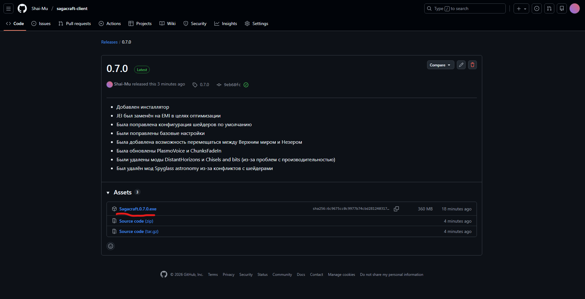
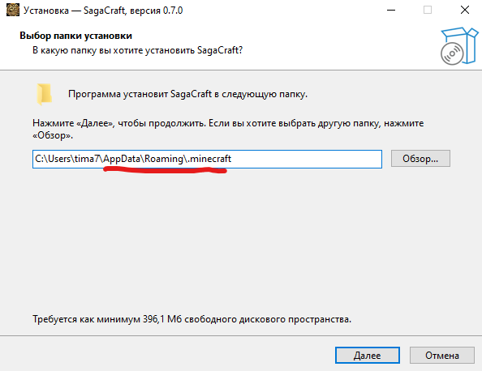

# Инструкция по установке

Чтобы присоединиться к игре в Sagacraft, необходимо выполнить ряд действий, каждое из которых описано ниже:

## ***1. Установка Minecraft***

Во-первых, необходимо поставить на свой компьютер нужную версию Minecraft и подготовить её к модификации. Для этого скачиваем лаунчер Minecraft. 

>В интернете существует множество программ-лаунчеров, но мы рекомендуем вам пользоваться **TLauncher** и дальнейший гайд будем вести для него.

### - ***Скачайте установщик лаунчера***. 

Для этого переходим по [ссылке](https://tlauncher.ru/) и нажмите на кнопку *"Скачать TLauncher"*, после этого во всплывшем окне выберите операционную систему, которая установлена на вашем компьютере (Windows, MacOS, Linux) и нажмимаем на кнопку *"TLauncher для <название вашей операционной системы>"*

### - ***Запустите установщик лаунчера и установите TLauncher***. 

Запускаем файл `TLauncher-Installer.exe` и следуем инструкциям по установке в самом установщике (Yandex Browser ставить не обязательно :) ).

### - ***Запустите TLauncher***

Перед нами появится окно лаунчера. Пока можем его закрыть.

### - ***Скачайте и установите сборку Sagacraft***

Для этого переходим по ссылке на последний [релиз](https://github.com/Shai-Mu/sagacraft-client/releases/latest) сборки и скачиваем Sagacraft.x.x.x.exe в любое место на компьютере

Запускаем скачавшийся установщик. Убеждаемся, что в качестве папки для установки указана именно та, в которую установлен Minecraft. (Как правило это папка .minecraft в AppData/Roaming)

Жмём "Далее". Затем жмём "Установить". Начнётся установка. После завершения снова открываем TLauncher.

### - ***Запустите Sagacraft***

Придумываем и указываем логин для подключения на сервер. Если есть аккаунт Microsoft с купленной копией Minecraft, включаем галочку "Аккаунты" и вводим данные аккаунта.

Нажимаем кнопку *"Войти в игру"*, чтобы запустить игру. Запуск модифицированной версии занимает существенное время - это нужно иметь ввиду.

### - ***Подключитесь к серверу***

У нас откроется главное игровое меню. Нажимаем на кнопку *"Сетевая игра"*

Откроется меню сетевой игры. В меню сетевой игры должен появиться сервер, наводимся на него и жмём на появившуюся **после наведения** иконку треугольника.

> Если сервер не появился, жмём кнопку "Добавить", берём текущий адрес сервера (91.197.99.163:25565), вставляем в поле "Адрес", жмём клавишу "Готово"

> Иногда сервер может долго не отвечать и писать, что он не доступен. Даже в таком случае имеет смысл попробовать подключиться к сервер
> Также часто возникает проблема, из-за которой при первом заходе на сервер игра может вылетать. Лечится повторным заходом на сервер. Мы знаем про эту проблему и работаем над ней :)
В итоге мы окажемся на сервере и в игровом чате нам будет предложено зарегистрироваться на сервере:

Придумываем пароль, нажимаем клавишу `/` и вводим команду register, а затем дважды пароль через пробел. Должно получиться что-то вроде:

Нажимаем Enter... Теперь можно играть!